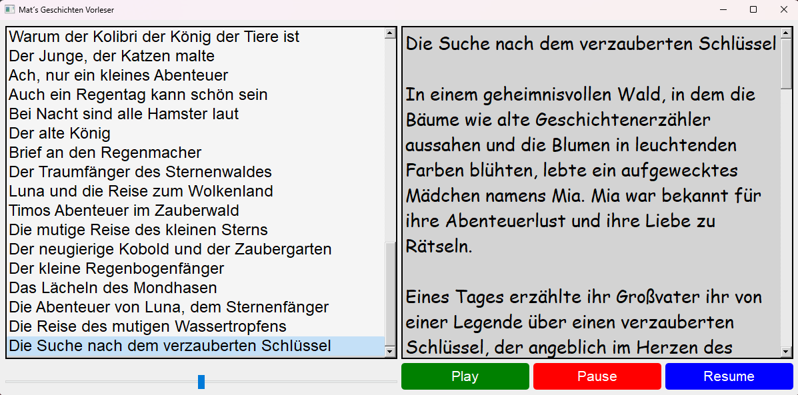

# Mat's Geschichten Vorleser

Inhaltsverzeichnis:
- [Preview](#preview)
- [Beschreibung](#mats-geschichten-vorleser)
- [Installation](#installation)
  - [Option 1: Komplette App (Empfohlen)](#option-1-komplette-app-empfohlen)
  - [Option 2: Eigenständige Ausführung](#option-2-eigenständige-ausführung)
- [Verwendung](#verwendung)
- [Autor](#autor)
- [Hinweis](#hinweis)
- [Lizenz](#lizenz)

## Preview



## Beschreibung

Mat's Geschichten Vorleser ist eine Windows-Desktop-Anwendung, die Text-to-Speech-Geschichten aus einer Datenbank abspielt. Mit dieser Anwendung können Sie Gutenachtgeschichten für Kinder vorlesen. Stellen Sie sicher, dass sich die Datenbankdatei `bed_storys.db` im selben Verzeichnis wie die Anwendung befindet.

## Installation

Um die Anwendung zu nutzen, folgen Sie diesen Schritten:

### Option 1: Komplette App (Empfohlen)

1. Laden Sie die neueste Version der Anwendung aus dem [Releases](https://github.com/Satisfraction/Bed-Time-Storys-Reader/releases/tag/v5.1.1) Bereich dieses Repositories herunter.

2. Entpacken Sie das Archiv und stellen Sie sicher, dass die Datei `bed_storys.db` im selben Verzeichnis wie die Anwendungsdatei `BedStorys.exe` liegt.

3. Doppelklicken Sie auf `BedStorys.exe`, um die Anwendung zu starten.

### Option 2: Eigenständige Ausführung

1. Installieren Sie die erforderlichen Bibliotheken, wenn Sie dies noch nicht getan haben:
    ```shell
    pip install PyQt5 gTTS
    ```

2. Clonen Sie dieses Repository oder laden Sie die Quellcode-Dateien herunter.

3. Führen Sie die Anwendung aus:
    ```shell
    python BedStorys.py
    ```

4. Stellen Sie sicher, dass sich die Datei `bed_storys.db` im selben Verzeichnis wie die Anwendungsdatei `BedStorys.py` befindet.

## Verwendung

1. Wählen Sie eine Geschichte aus der Liste auf der linken Seite aus.

2. Klicken Sie auf die Schaltfläche "Play", um die Geschichte anzuhören.

3. Verwenden Sie die Schaltflächen "Pause" und "Resume", um die Audiowiedergabe zu steuern.

4. Verwenden Sie den Lautstärkeregler, um die Audio-Lautstärke anzupassen.

## Autor

**Mat's Geschichten Vorleser wurde von Satisfraction erstellt.**

## Hinweis

**Die Funktionalität für das Vorlesen von Geschichten basiert auf der gTTS (Google Text-to-Speech) -Bibliothek.**

## Lizenz

Dieses Projekt ist unter der MIT-Lizenz lizenziert. Siehe die [LICENSE](LICENSE) Datei für Details.

**Hinweis: Die Anwendung verwendet die functions.py-Datei für die Text-to-Speech-Funktionalität und die Datenbankkommunikation. Stellen Sie sicher, dass Sie diese Datei ebenfalls im Verzeichnis haben, bevor Sie die Anwendung ausführen.**

Wenn Sie die vollständige App herunterladen (Option 1), können Sie die Anwendung direkt nutzen.
